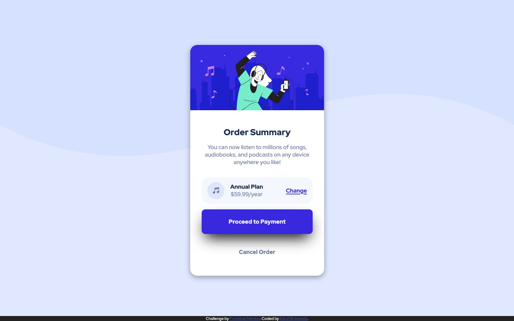

# Frontend Mentor - Order summary card solution

This is a solution to the [Order summary card challenge on Frontend Mentor](https://www.frontendmentor.io/challenges/order-summary-component-QlPmajDUj). Frontend Mentor challenges help you improve your coding skills by building realistic projects. 

## Table of contents

- [Overview](#overview)
  - [The challenge](#the-challenge)
  - [Screenshot](#screenshot)
  - [Links](#links)
- [My process](#my-process)
  - [Built with](#built-with)
  - [What I learned](#what-i-learned)
  - [Useful resources](#useful-resources)
- [Author](#author)

## Overview

### The challenge

Users should be able to:

- See hover states for interactive elements

### Screenshot

### Links

- Solution URL: [GitHub - GrzywN/order-summary-component-main](https://github.com/GrzywN/order-summary-component-main)
- Live Site URL: [Repl.it](https://order-summary-component-main.grzywn.repl.co)

## My process

### Built with

- HTML
- SCSS
- Flexbox
- CSS animations/transitions with @keyframes
- SCSS variables

### What I learned

I've used max-content and min-content for sizing of objects in my project. I've never used them before and they can come in handy while dealing with sizing text and images. Using those properties is also responsive, so I don't need to care about my layout being different on mobile screens.

### Useful resources

- [Imagecolorpicker](https://imagecolorpicker.com/) - I could get colors from the design straight into my project

## Author

- GitHub - [GrzywN (Karol Binkowski) · GitHub](https://github.com/GrzywN)
- Frontend Mentor - [@GrzywN](https://www.frontendmentor.io/profile/GrzywN)
- Discord - fansik#2808
